# AWS Resource Provisioning using Python (Boto3)

## Cloud Native Application – Activity 1

**Name:** Ashish Sanjay Gaikar  
**PRN:** 202301040070  
**Semester:** VI  
**Course:** Cloud Native Application  
**Region Used:** ap-south-1 (Mumbai)

---

## Objective

To configure AWS SDK and programmatically launch AWS resources using Python (Boto3), including:

- VPC  
- EC2  
- IAM  
- S3  

This activity demonstrates Infrastructure as Code (IaC) principles using AWS SDK.

---

## Environment Setup

- Python already installed  
- Boto3 already installed  
- AWS CLI already configured  
- Default region: `ap-south-1`  

No additional installation was required.

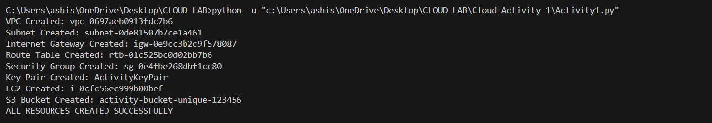
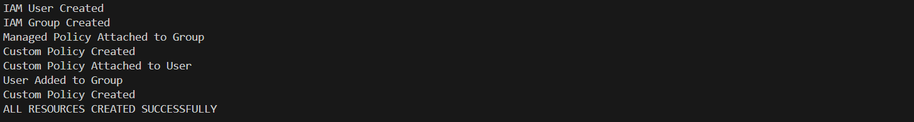

---

# Step-by-Step Implementation

---

## Step 1: Create VPC

- CIDR Block: `10.0.0.0/16`
- Tagged as `Activity-VPC`

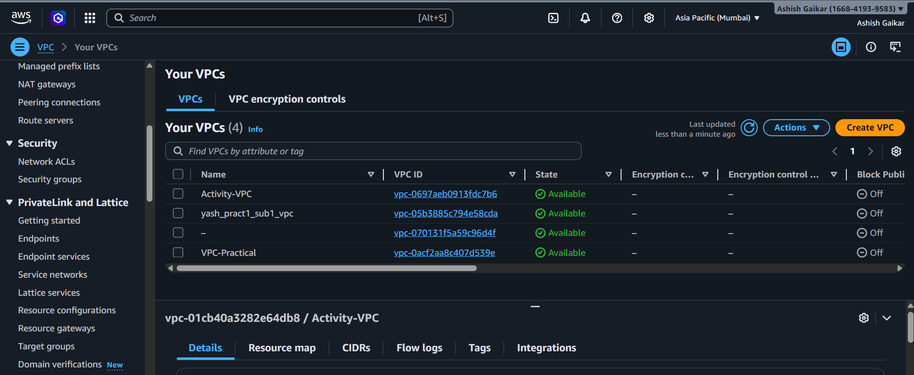

---

## Step 2: Create Subnet

- CIDR Block: `10.0.1.0/24`
- Tagged as `Activity-Subnet`

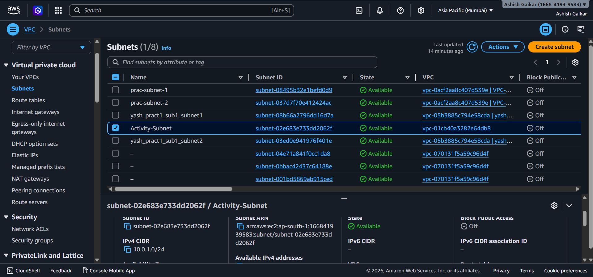

---

## Step 3: Create Internet Gateway

- Created Internet Gateway
- Attached to VPC

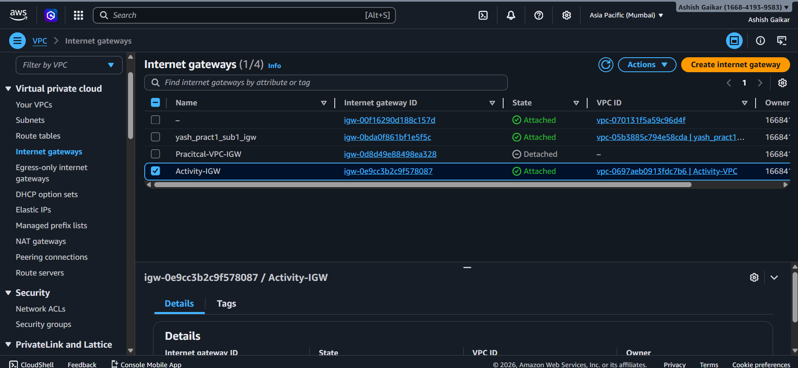

---

## Step 4: Create Route Table

- Created Route Table
- Added default route `0.0.0.0/0 → IGW`
- Associated with subnet

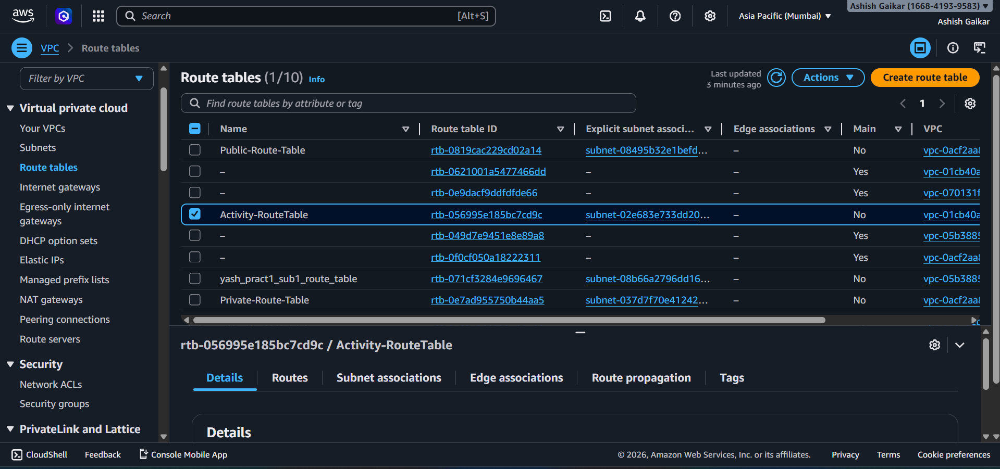

---

## Step 5: Create Security Group

- Allowed inbound SSH (Port 22)
- Tagged as `Activity-SG`

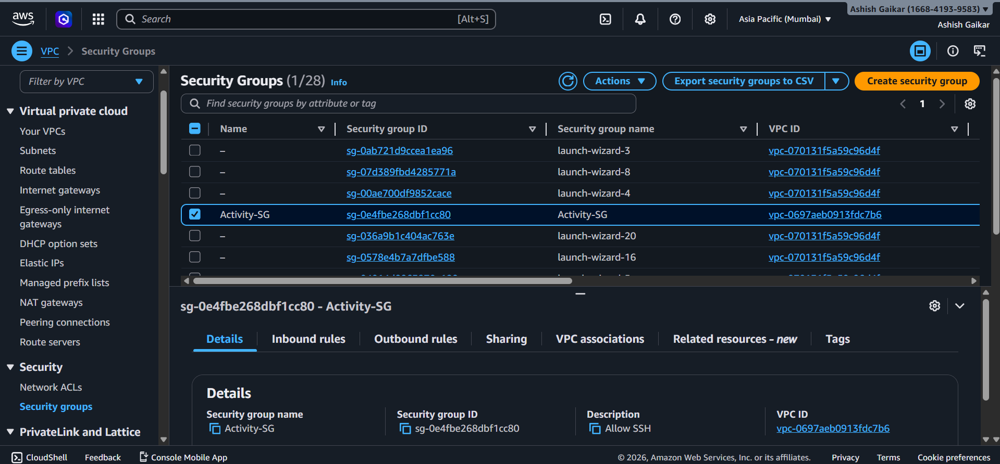

---

## Step 6: Create Key Pair

- Key Name: `ActivityKeyPair`
- Used for EC2 SSH access

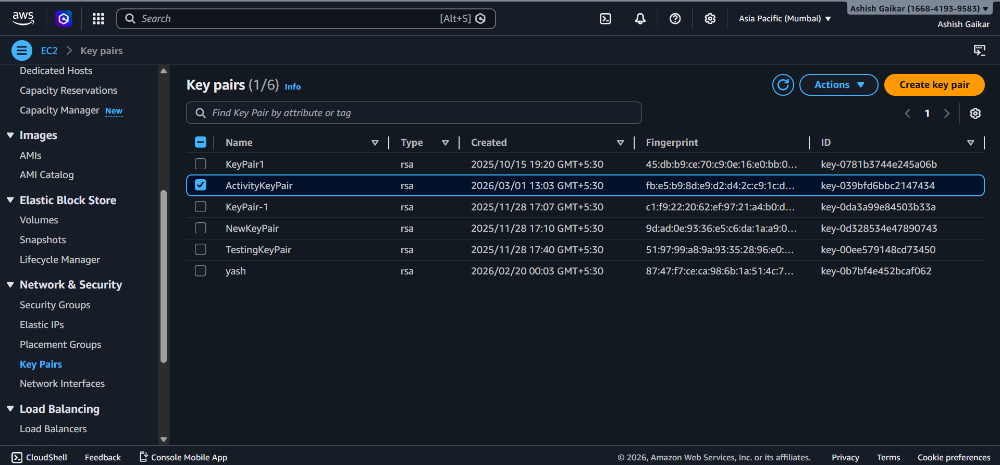

---

## Step 7: Launch EC2 Instance

- Instance Type: `t3.micro`
- Hardcoded Amazon Linux AMI
- Launched inside created subnet
- Attached security group
- Associated key pair

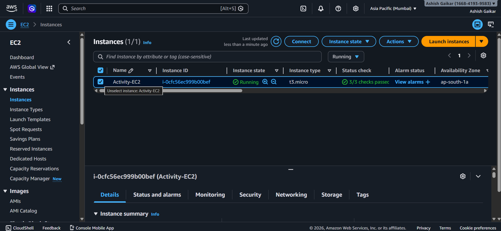

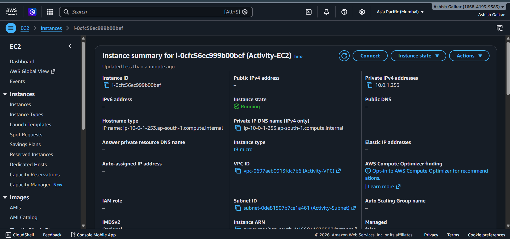

---

## Step 8: Create S3 Bucket

- Created bucket in `ap-south-1`

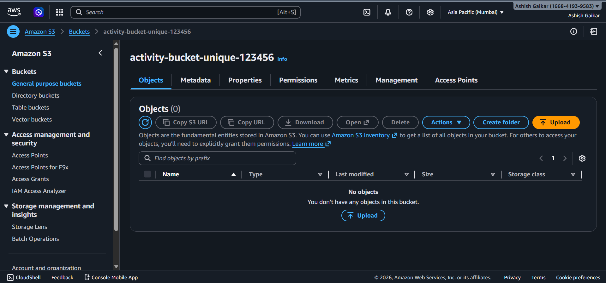

---

# Step 9: Create IAM Resources

The following IAM components were created:

- IAM User → `ActivityUser`
- IAM Group → `ActivityGroup`
- Managed Policy → `AmazonS3FullAccess`
- Custom Policy → `ActivityCustomPolicy`
- User added to Group
- Custom policy attached to user

---

### IAM User Created

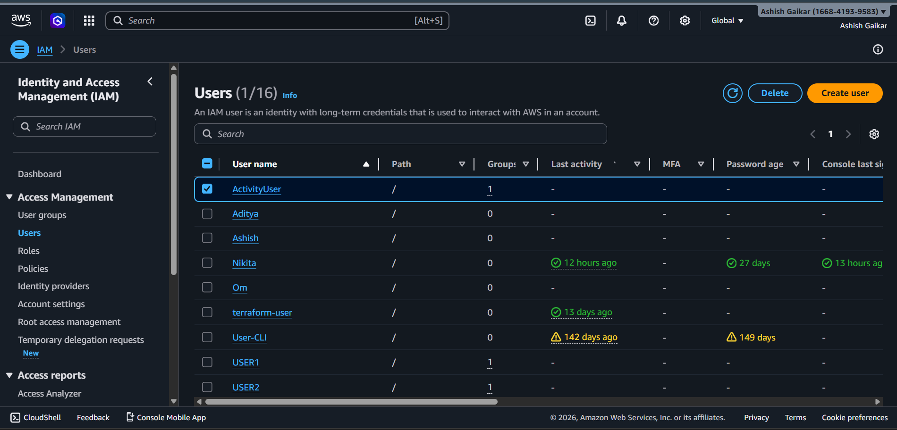

---

### IAM Group Created

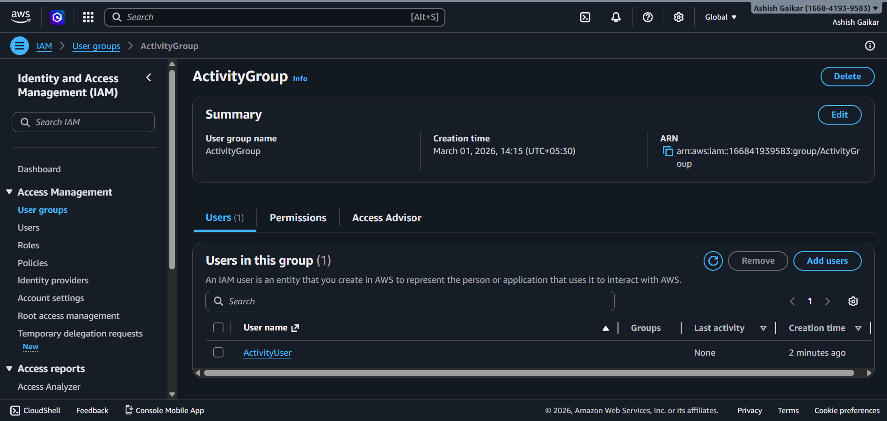

---

### Managed Policy Attached to Group

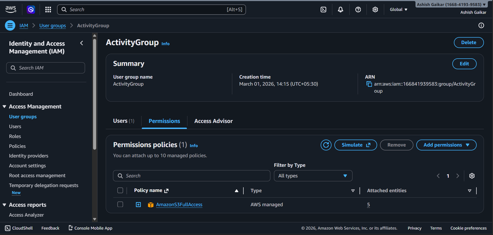

---

### Custom Policy Created

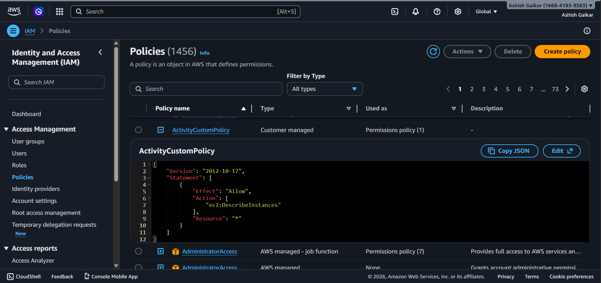

---

### Custom Policy Attached to User

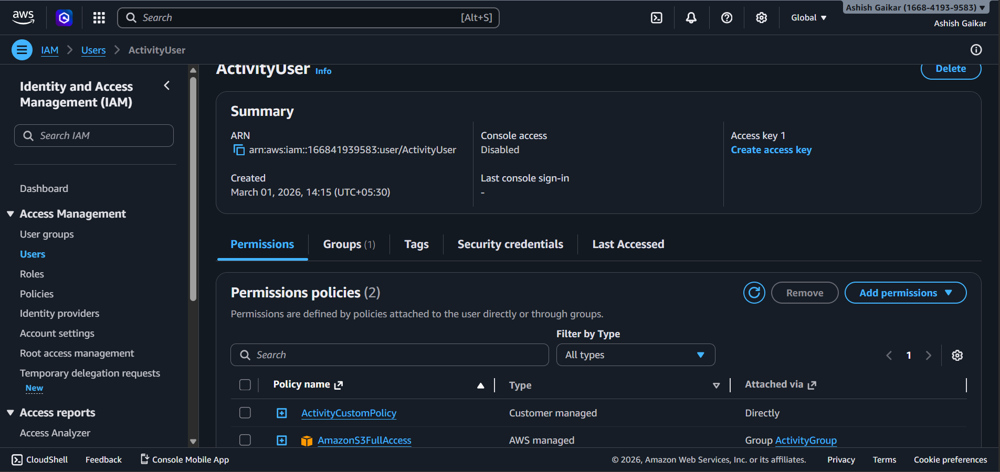

---

# Complete Python Implementation (`activity1.py`)

```python
import boto3
import json

region = "ap-south-1"

ec2 = boto3.client("ec2", region_name=region)
s3 = boto3.client("s3", region_name=region)
iam = boto3.client("iam")

# Create VPC
vpc = ec2.create_vpc(CidrBlock="10.0.0.0/16")
vpc_id = vpc["Vpc"]["VpcId"]
ec2.create_tags(Resources=[vpc_id], Tags=[{"Key": "Name", "Value": "Activity-VPC"}])

# Create Subnet
subnet = ec2.create_subnet(VpcId=vpc_id, CidrBlock="10.0.1.0/24")
subnet_id = subnet["Subnet"]["SubnetId"]
ec2.create_tags(Resources=[subnet_id], Tags=[{"Key": "Name", "Value": "Activity-Subnet"}])

# Internet Gateway
igw = ec2.create_internet_gateway()
igw_id = igw["InternetGateway"]["InternetGatewayId"]
ec2.attach_internet_gateway(InternetGatewayId=igw_id, VpcId=vpc_id)

# Route Table
route_table = ec2.create_route_table(VpcId=vpc_id)
route_table_id = route_table["RouteTable"]["RouteTableId"]
ec2.create_route(RouteTableId=route_table_id,
                 DestinationCidrBlock="0.0.0.0/0",
                 GatewayId=igw_id)
ec2.associate_route_table(RouteTableId=route_table_id,
                          SubnetId=subnet_id)

# Security Group
sg = ec2.create_security_group(
    GroupName="Activity-SG",
    Description="Allow SSH",
    VpcId=vpc_id
)
sg_id = sg["GroupId"]

ec2.authorize_security_group_ingress(
    GroupId=sg_id,
    IpPermissions=[{
        "IpProtocol": "tcp",
        "FromPort": 22,
        "ToPort": 22,
        "IpRanges": [{"CidrIp": "0.0.0.0/0"}]
    }]
)

# Key Pair
key_name = "ActivityKeyPair"
ec2.create_key_pair(KeyName=key_name)

# Launch EC2
ami_id = "ami-0f5ee92e2d63afc18"
ec2.run_instances(
    ImageId=ami_id,
    InstanceType="t3.micro",
    KeyName=key_name,
    MinCount=1,
    MaxCount=1,
    SubnetId=subnet_id,
    SecurityGroupIds=[sg_id]
)

# Create S3 Bucket
s3.create_bucket(
    Bucket="activity-bucket-unique-123456",
    CreateBucketConfiguration={"LocationConstraint": region}
)

# IAM Resources
user_name = "ActivityUser"
group_name = "ActivityGroup"

iam.create_user(UserName=user_name)
iam.create_group(GroupName=group_name)

iam.attach_group_policy(
    GroupName=group_name,
    PolicyArn="arn:aws:iam::aws:policy/AmazonS3FullAccess"
)

policy_document = {
    "Version": "2012-10-17",
    "Statement": [{
        "Effect": "Allow",
        "Action": ["ec2:DescribeInstances"],
        "Resource": "*"
    }]
}

policy = iam.create_policy(
    PolicyName="ActivityCustomPolicy",
    PolicyDocument=json.dumps(policy_document)
)

iam.attach_user_policy(
    UserName=user_name,
    PolicyArn=policy["Policy"]["Arn"]
)

iam.add_user_to_group(
    GroupName=group_name,
    UserName=user_name
)

print("All resources created successfully")
```

---

# Conclusion

This activity successfully demonstrates automated AWS infrastructure provisioning using Python (Boto3), covering:

- VPC Networking  
- EC2 Deployment  
- S3 Storage  
- IAM User & Policy Management  

All resources were verified using AWS Console screenshots.

---
